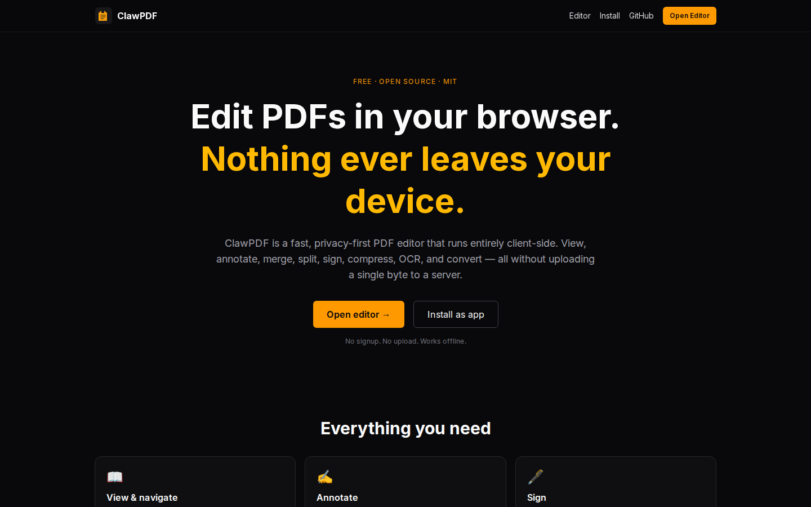
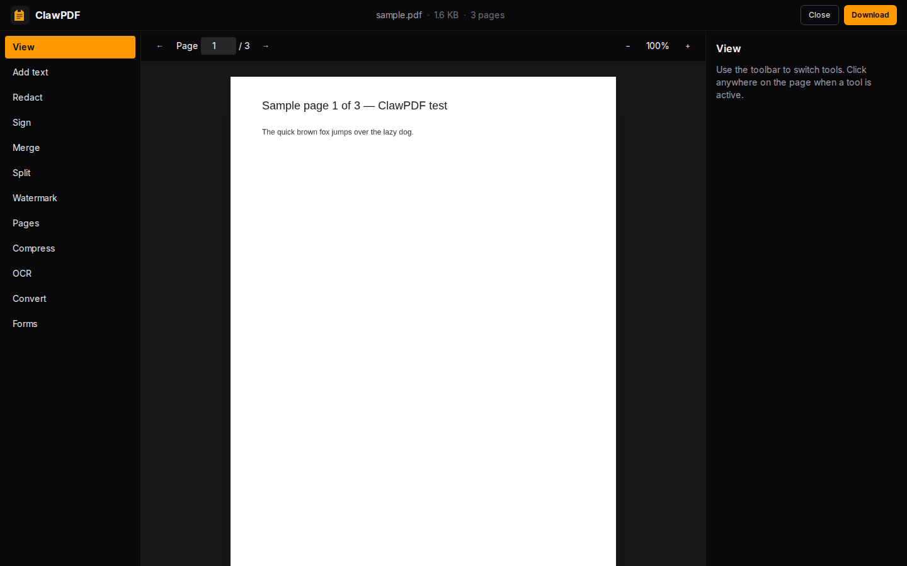
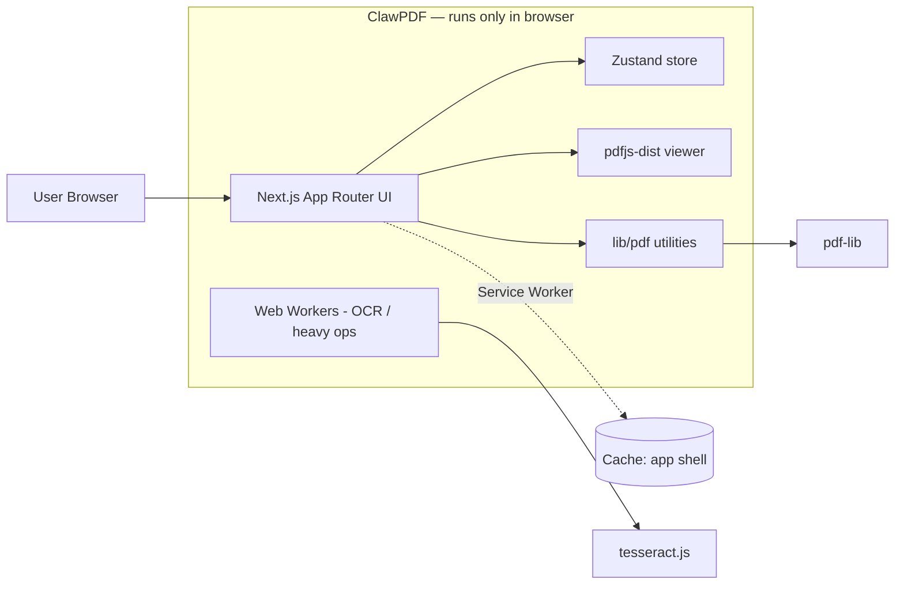

# ClawPDF

> Edit PDFs in your browser. Nothing ever leaves your device.

[](./LICENSE)
[](https://nextjs.org/)
[](#testing)
[](#install-as-app)

ClawPDF is a free, privacy-first, open-source PDF editor that runs entirely
client-side. Built with Next.js 15, React 19, Tailwind v4, `pdf-lib`, `pdfjs-dist`,
and `tesseract.js`. There is no backend. There is no upload. There is nothing
to track because there is no server.

**Live: [clawpdf.netlify.app](https://clawpdf.netlify.app)**




## Features

- View & navigate (multi-page, zoom, page input, fit-to-width)
- Add text overlays, redact (black box) anywhere on a page by click
- Draw and place a flattened signature (PNG embed via pdf-lib)
- Merge multiple PDFs into one
- Split by page ranges (`1-3,5,7-9`) or every N pages
- Rotate, reorder, extract, delete pages
- Watermark text + page numbers (configurable position)
- Compress (object-stream rebuild + metadata strip)
- OCR per page via Tesseract.js (lazy-loaded, ~5MB on first use)
- Convert PDF → plain text, images → PDF
- Detect & list AcroForm fields; programmatic fill/flatten

## Architecture



There is no server. The static export is served by Netlify and cached locally
by a service worker for offline use.

## Stack

| Concern | Choice |
| --- | --- |
| Framework | Next.js 15 App Router (static export) |
| Language | TypeScript strict |
| Styling | Tailwind CSS v4 |
| State | Zustand |
| PDF rendering | pdfjs-dist |
| PDF mutation | pdf-lib |
| OCR | tesseract.js (lazy-loaded) |
| File DnD | react-dropzone |
| PWA | Custom service worker + manifest |
| Tests | Vitest |
| CI | GitHub Actions |
| Hosting | Netlify (static) |

## Getting started

```bash
npm install
npm run dev          # localhost:3000
npm test             # vitest unit tests
npm run typecheck    # tsc --noEmit
npm run lint
npm run build        # static export to ./out
```

## Install as app

Open the editor in Chrome, Edge, or Safari and click the install icon in the
address bar (Chrome/Edge), or use **File → Add to Dock** in Safari. On iOS,
**Share → Add to Home Screen**. On Android, menu → **Install app**.

## Privacy

ClawPDF is shipped as static HTML/JS/CSS. There is no analytics tracker, no
telemetry, and no backend that sees your files. The only third-party calls are
to `unpkg.com` for the PDF.js worker bundle and to the Tesseract CDN for OCR
language data — both stateless asset fetches.

## Testing

Unit tests live in `tests/` and cover every PDF utility under `src/lib/pdf/`.

```bash
npm test
```

CI runs install → lint → typecheck → unit tests → build on every push and pull
request.

## License

MIT — © Sprintsite LLC. See [LICENSE](./LICENSE).
